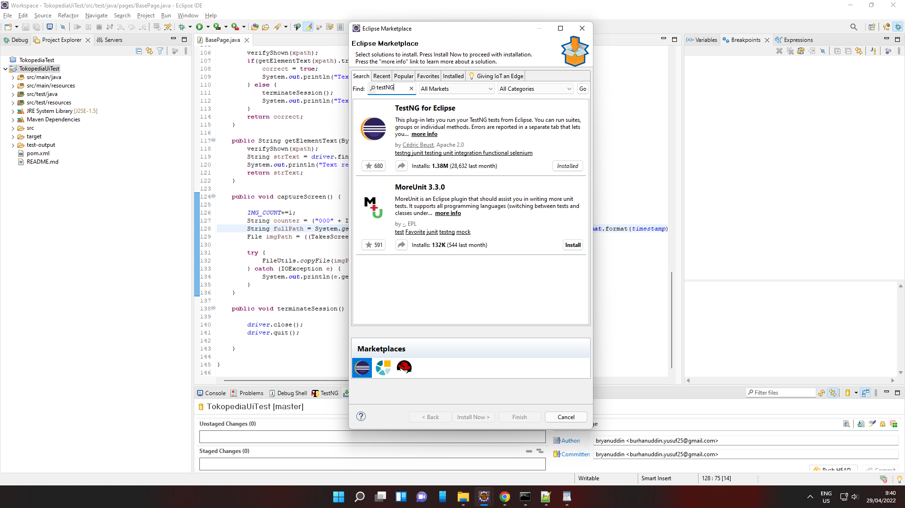
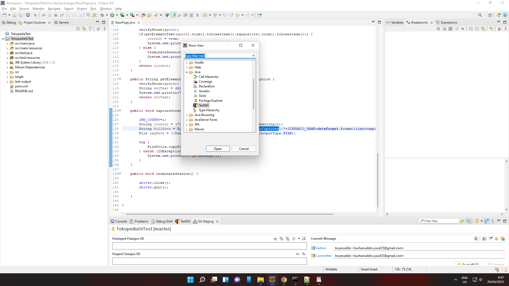

# UI Automation Assignments

***Tokopedia*** UI Automation Test project assigned to Habib

## Part 1: Getting started

### Requirements

Here is a complete list of the setup:

- Eclipse IDE
- Chrome Browser 101.0.4951.41 or earlier
- Java 8

### Installation

#### 1. Install Eclipse IDE

To run this project you will need an IDE. You may use your preferred IDE, but in this case, we are going to use Eclipse. In order to install it, please download [Eclipse for Java](https://www.eclipse.org/downloads/packages/).

Complete the installation process.

Open the eclipse, and then go to Help > Eclipse Marketplace...

And then search TestNG.

You will see something similar with this:

Complete the installation. To verify your installation, go to Window > Show View > Other.

You will see something similar with this:

#### 2. Install Java 8 and set JAVA_HOME

Since we are using java to write our test, we need to install Java Development Kit (JDK). Specifically, [Java 8](https://java.com/en/download/manual.jsp).

Download and complete the installation process.

After that, add these two lines to your system environment:

> JAVA_HOME with Path/of/your/JDK/
> 
> Append %JAVA_HOME%\bin into your system Path

#### 3. Install Google Chrome 101.0.4951.41 or earlier

To install google chrome.

You may visit this [site](https://www.google.com/chrome/).

## Part 2: Run the Test

### 1. Clone the Project

After completing the installation processes, you're almost there to run the test.

In order to do it, clone project ***TokopediaTest*** project from [Github](https://github.com/haga2554/TokopediaTest).

### 2. Open Project with Eclipse and Build

Once, the project is cloned to your local machine, open this project with Eclipse.

Then go to Project > Clean...

After that go to Project > Build Project.

Since the project is using Maven, this process will also be retrieving all required dependencies that are stated in the ***pom.xml*** file.

Please wait until all those dependencies are successfully downloaded.

### 3. Execute the Test

If you reached this part, then you're all set and ready to execute the test scenarios.

All the test scenarios are located in src/test/java/scenarios

Open one file e.g.

> SortProductsFromHighestAndCheckoutFirstItem.java

To execute the test, simply

> go to Run > Run As > TestNG
>
> or
> 
> right-click on the code then go to Run As > TestNG

Once the execution process is done. Update the project folder, you will see the ScreenCaptures folder in the project explorer.

This folder will automatically generate every runtime process, marked with a specific timestamp so we will not be losing any results/evidence.

There will be a test-output folder, containing the test report that is generated every runtime process. To see it, you may open ***index.html*** inside this folder using your browser.

## Part 3: Framework Summary

This project uses Maven, Java, selenium, and TestNG. This combination is aiming for Maintainability, Usability, and Reporting.

Maven is long to be known as one of the most common project management tools. It helps the maintainability of this project to work collaboratively, swap and manage many dependencies, etc. The alternative version of this tool is Gradle, which newer and more simple dependencies manager.

TestNG itself was chosen as it is the advanced version of JUnit/NUnit. The use of TestNG will allow test engineers to cover many test categories whether unit, functional, e2e, or integration. And also this framework comes with a built-in report that will be generated for every runtime process.

## Part 4: Improvements

- Properties file: Adding properties file is one of the best solutions to manage many configurations that are quite complex and it will ease maintaining the many values in many environments. This improvement should be the first thing that I consider to be implemented in the framework.

- Append Cucumber framework: Cucumber is Behavior Driven Development (BDD) framework. Using this tool will significantly ease the scenario maker because the syntax is humanised even for non-engineer. It will surely raise readability for the code/test scenario. Furthermore, it has many localisations so we can create the test scenario using Bahasa Indonesia or Javanese.

## Authors

+ Habib (burhanuddin.yusuf25@gmail.com) - Initial _Readme_ on 29/04/2022

_P.S. Kindly update this section after modyfiying this Readme file_
